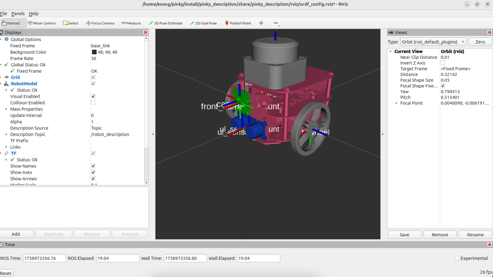
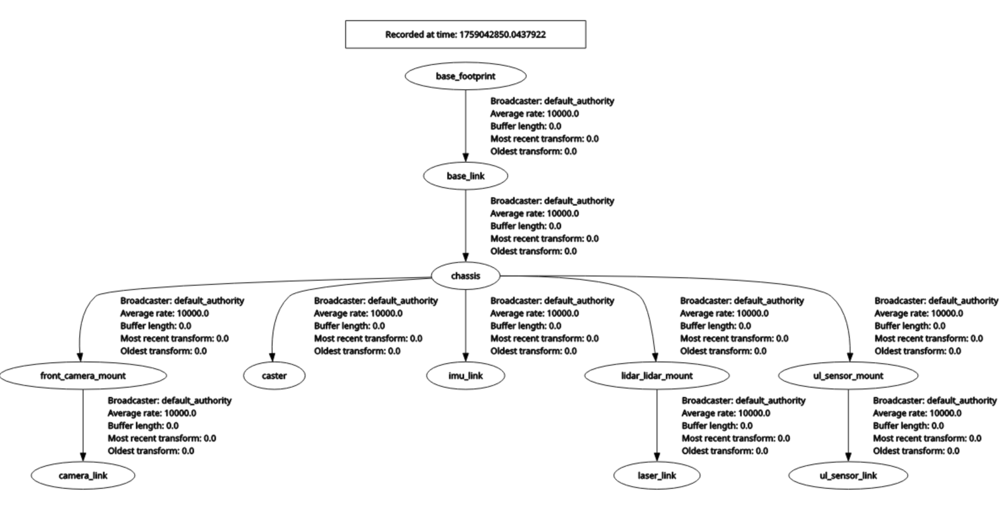

# 주행 로봇 SDF 파일 이해하기

### URDF와 SDF
<br>

**차이**

| **URDF** | **SDF** |
| --- | --- |
| ROS 중심 | Gazebo 중심 |
| 로봇 모델링에 특화 | 로봇 모델링 + ‘**환경, 센서, 플러그인, 조명, 지형까지 기술’** |
| 센서, 환경, 물리엔진 옵션은 제한적 | 물리엔진에 맞춘 파라미터를 세밀하게 정의 가능 |

<br>

**표현 범위**

| **URDF** | link, joint, visual, collision, inertial  |
| --- | --- |
| **SDF** | **URDF 태크 + world(환경 전체) + sensor(카메라, Lidar, IMU 등) + plugin (ros와 연동, 물리 기능 추가)** |

<br>

**URDF에 없고 SDF에 있는 태그 기본 개념 정리하기**

- **world**
    
    시뮬리에션 전체 환경을 정의(바닥, 중력, 조명, 지형 등)
    
- **sensor**
    
    로봇에 장착된 센서를 정의(lidar, camera, imu 등)
    
    ROS 노드에서 센서 데이터를 토픽으로 구독해서 받은 다음에 SLAM, Navigation에서 사용하게 됨. (예를 들어, Lider 센서라면 /scan 토픽을 구독)
    
- **plugin**
    
    gazebo에서 동작하는 플러그인으로, 외부와 연결해 주는 역할을 한다(주로 ros).
    
    플러그인이 있어야 gazebo에서 생성된 센서 데이터를 ros 토픽으로 보내고, ros로부터 명령을 받아 로봇을 제어할 수 있다.
<br><br>    

---

### 분석할 주행 로봇 구조
<br>

아래 구조는 분석할 SDF 파일에 정의된 주행 로봇 구조이다:



<br>

---

### SDF 파일 이해하기 - world 설정
<br>

**world 정의**

```xml
<world name="car_world">
	...
</world>
```

- gazebo에서 실행되는 전체 시뮬레이션 환경을 정의하는 블록이다. gazebo에서는 항상 환경을 먼저 정의한 뒤 로봇을 포함시킨다.
- **`name=”car_world”`**: 환경 이름을 ‘car_world’로 정의
<br><br>


**물리엔진 설정**

physics 태그로 world의 물리엔진을 설정해준다:

```xml
<physics name="1ms" type="ignored">
    <max_step_size>0.001</max_step_size>
    <real_time_factor>1.0</real_time_factor>
</physics>
```

- **`max_step_size`**: 시뮬레이션에서 한 번에 진행하는 ‘물리 시간 단위’
- **`real_time_factor`**: 시뮬레이션에서 시간이 실제 시간(real time)과 얼마나 일치하는지
    - 1.0 → 실제 시간과 동일한 속도로 진행
    - 0.5 → 실제보다 절반 속도로 느리게 진행
<br><br>

**플러그인 추가**

```xml
<plugin
    filename="gz-sim-physics-system"
    name="gz::sim::systems::Physics">
</plugin>

<plugin
    filename="gz-sim-user-commands-system"
    name="gz::sim::systems::UserCommands">
</plugin>

<plugin
    filename="gz-sim-scene-broadcaster-system"
    name="gz::sim::systems::SceneBroadcaster">
</plugin>
```

- **Physics** 플러그인
    - 물리 법칙(중력, 충돌, 마찰, 관성 등) 시뮬레이션의 핵심 역할
- **UserCommands** 플러그인
    - 사용자가 모델을 생성, 이동, 삭제하는 기능 제공
    - 마우스/키보드 인터랙션을 제공해서 사용자가 직접 로봇이나 물체를 핸들링할 수 있음
- **SceneBroadcaster** 플러그인
    - RViz처럼 사용자에게 월드의 시뮬레이션을 시각적으로 표시하는 기능을 제공
<br><br>

SDF 파일에 위와 같은 플러그인을 추가하면, 추가한 플러그인이 활성화 된다. 추가하지 않으면 활성화되지 않으니 사용할 수가 없다. 

예를 들어, UserCommands 플러그인을 SDF 파일에 추가하지 않았다면, 시뮬레이션 환경이 시각화는 되어있겠지만 마우스/키보드로 사용자가 직접 로봇이나 물체를 핸들링할 수는 없게 된다.
<br><br>

**light 설정**

```xml
<light type="directional" name="sun">
    <cast_shadows>true</cast_shadows>
    <pose>0 0 10 0 0 0</pose>
    <diffuse>0.8 0.8 0.8 1</diffuse>
    <specular>0.2 0.2 0.2 1</specular>
    <attenuation>
        <range>1000</range>
        <constant>0.9</constant>
        <linear>0.01</linear>
        <quadratic>0.001</quadratic>
    </attenuation>
    <direction>-0.5 0.1 -0.9</direction>
</light>
```
<br><br>

---

### SDF 파일 이해하기 - Ground 설정해주기
<br>

**model 태그**<br>
model 태그는 SDF에서 로봇이나 물체를 하나로 나타내는 단위이다.<br>
예를 들어, 로봇을 구성할 때 팔, 다리, 몸체 등이 있을텐데 이 구성요소들을 하나로 묶어준다:

```xml
<model name="my_robot">
		<link name="chassis"> ... </link>
		<link name="wheel_left"> ... </link>
		<link name="wheel_right"> ... </link>
			...
</model>
```
<br>

**ground 부분 정의해주기**

```xml
<model name="ground_plane">
    <static>true</static>
    <link name="link">
     ...
    </link>
</model>
```

- gazebo에서는 ground도 하나의 모델(model)로 묶어주는 게 일반적이다.<br>
    -> 플러그인, staic태그 등을 추가해줄 수 있음
- **`static=ture`**: 움직이지 않는 객체로 정의 가능
<br><br>

**ground의 링크는 collision과 visual로 이루어짐**

```xml
<model name="ground_plane">
    <static>true</static>
    <link name="link">
    
        <collision name="collision">
				 ...
        </collision>
        
        <visual name="visual">
				 ...
        </visual>
        
    </link>
</model>
```

- collision은 땅의 충돌 속성을 담당하고, visual은 땅의 시각화 담당
<br><br>

**collision 태크로 충돌 속성 정의**

```xml
<collision name="collision">
    <geometry>
        <plane>
            <normal>0 0 1</normal>
        </plane>
    </geometry>
</collision>
```

- **geometry**
    - 모양/형태를 정의
    - collision은 충돌 속성 담당인데, geometry 태그를 사용해 모양/형태를 정의하는 이유는?
        
        → 물리 엔진이 실제 계산을 하기위해선 충돌 부분의 어떤 모양인지, 법선 벡터 등의 정보 .. 등을 알아야 함
        
- **plane**
    - 평면 (땅, 벽 등)
- **`normal 0 0 1`**
    - 평면에 수직인 법선 벡터(normal)를 정의
    - 0 0 1이 의미하는 건 방향인데, z 방향으로 법선 벡터 방향을 설정하겠다는 거
    - 만약 땅이 아니라 천장을 만드는 상황이었다면 0 0 -1, 벽이었다면 1 0 0(벽마다 다르겠지만..)
- **법선 벡터를 정의하는 이유**
    
    충돌 반발력 방향을 계산해주기 위해서이다. ‘**법선 벡터 방향’ = ‘충돌 반발력이 나올 방향’**
    
    예를 들어, 로봇이 벽에 부딪히면 법선 벡터 방향으로 힘이 적용돼 튕겨나가고, 사과가 땅에 떨어지면 천장 방향으로 사과게 튕기도록 해줄 수 있음
<br><br>    

**visual 태크로 시각적 속성 정의**

- **geometry 태그로 형태를 정의해주기**
    
    ```xml
    <visual name="visual">
    		<geometry>
    		    <plane>
    				    <normal>0 0 1</normal>
    				    <size>100 100</size>
    		    </plane>
    		</geometry>
    </visual>
    ```
    
    - collision이 아니고 visual 태크니까 법선 벡터가 필수는 아님(collision에서는 충돌 물리적 계산에 사용됨). 하지만 그림자, 조명 계산시 표면 방향을 참고하니까 포함시켜두는 게 좋음
    - plain의 사이즈는 100 100 으로<br><br>

- **meterial 태그로 평면의 재질을 정의**
    
    ```xml
    <visual name="visual">
        <material>
            <ambient>0.8 0.8 0.8 1</ambient>
            <diffuse>0.8 0.8 0.8 1</diffuse>
            <specular>0.8 0.8 0.8 1</specular>
        </material>
    </visual>
    ```
    
    - **ambient**: 그림자 속이나 간접광 영역에도 일정한 밝기를 주는 기본 조명
    - **diffuse**: 표면이 광원과 마주한 정도에 따라 밝기가 변하는 확산 반사
    - **specular**: 표면의 반짝임(광택)을 표현하는 경면 방사
    - 사실 빛까지 신경써줄 필요는 없음
<br><br>    

---

### SDF 파일 이해하기 - 만들어줄 자동차 모델 구조 살펴보기
<br>

**모델 전체 구조**


- left_wheel과 right_wheel은 chassis와 각각 revolute 타입의 조인트를 통해 연결
<br><br>

**vehicle_blud 모델 정의하기**

```xml
<model name='vehicle_blue' canonical_link='chassis'>
		<pose relative_to='world'>0 0 0 0 0 0</pose>
</model>
```

- **`canonical_link=’chassis’`**
    
    모델의 대표 링크(기준 링크)를 chassis로 지정. 즉 vehicle_bule 모델의 전체 기준 좌표이다.
    
- **`pose relative_to=’world’`**
    - pose 태그를 통해 설정할 좌표가 어떤 좌표계를 기준으로 하는지를 명시해줌. 위의 코드에서는 world 좌표를 기준으로 (0,0,0) 좌표 이동, (0,0,0) 회전이다.
    - 현재 이 sdf 파일의 링크나 모델 이름 중에 world는 없는데 위에 코드에서 의미하는 world는 무엇일까
        
        → world는 sdf/gazebo에서 미리 정의된 적연 좌표계이다. 즉 위의 코드에서 의미하는 건 전역 원점(0,0,0)을 기준으로 위치하겠다는 거다.
        
        → 모델은 `relative_to=’world’`를 생략해도 디폴트로 world를 기준으로 한다. 즉 위의 코드는 `<pose>0 0 0 0 0 0</pose>`과 동일하다. (모델이 아닌 링크라면 디폴트가 모델로 설정된다)
<br><br>        

---

### SDF 파일 이해하기 - chassis 링크
<br>

**chassis 링크 정의하기**

```xml
<link name="chassis">
		<pose relative_to='__model__'>0.5 0 0.4 0 0 0</pose>
</link>
```

- **`__model__`**
    - MujoCo에서 사용하는 특별한 키워드로, 현재 링크 자신이 포함된 모델의 원점을 의미한다.
    - 현재 chassis 링크의 모델은 world를 기준으로 (0,0,0) 이동, (0,0,0) 회전이니, 결국 chassis는 world를 기준으로 (0.5, 0, 0.4) 이동한 곳에 위치하게 된다.
    - 링크는 relative_to를 생략하면 디폴트로 현재 자신이 포함된 모델을 기준으로 하기때문에, 위의 코드는 `<pose>0.5 0 0.4 0 0 0</pose>`과 동일하다.
<br><br>

**물리적 속성 정의하기 - inertial**

```xml
<inertial> <!--inertial properties of the link mass, inertia matix-->
    <mass>1.14395</mass>
    <inertia>
        <ixx>0.095329</ixx>
        <ixy>0</ixy>
        <ixz>0</ixz>
        <iyy>0.381317</iyy>
        <iyz>0</iyz>
        <izz>0.476646</izz>
    </inertia>
</inertial>
```

- **mass**
    - 링크의 질량(kg)
    - 시뮬레이션에서 중력, 충돌, 힘 계산에 직접 쓰인다.
- **inertia**
    - 링크의 관성 모멘트를 정의해주는 태그이다.
    - 관성 모멘트는 물체가 회전 운동을 하는 상태를 계속 유지하려는 성질인데, 시뮬레이션에서 물리적 현실성을 최대한 보장하기 위해 무조건 정의해주어야 함
<br><br>

**시각적 속성 정의하기 - visual**

```xml
<visual name='visual'>
    <geometry>
        <box>
            <size>2.0 1.0 0.5</size>
        </box>
    </geometry>
    <!--Color of the link-->
    <material>
        <ambient>0.0 0.0 1.0 1</ambient>
        <diffuse>0.0 0.0 1.0 1</diffuse>
        <specular>0.0 0.0 1.0 1</specular>
    </material>
</visual>
```
<br>

**충돌 속성 정의하기 - collision**

```xml
<collision name='collision'>
    <geometry>
        <box>
            <size>2.0 1.0 0.5</size>
        </box>
    </geometry>
</collision>
```

- 위에서 정의한 visual과 동일하게 geometry 태그를 정의해주었는데, 충돌 계산을 해주려면 현재 링크의 형태와 사이즈를 통해서 계산을 하기 때문이다.
<br><br>

---

### SDF 파일 이해하기 - left wheel 링크
<br>

**left wheel 링크 정의하기**

```xml
<link name='left_wheel'>
    <pose relative_to="chassis">-0.5 0.6 0 -1.5707 0 0</pose> <!--angles are in radian-->
</link>    
```

- **pose**
    - **`relative_to=”chassis”`**: chassis를 기준으로 위치를 세팅해줌
    - chassis pose를 기준으로 (-0.5 0.6 0) 이동하여 위치한다.
    - (-1.5707, 0, 0) 회전은 x 축 기준으로 90도 회전을 의미한다. 처음에 cylider 태그를 사용하여 생성해주면 원기둥이 옆으로 세워져있지 않으니 바퀴 모양이 아닌 상태이다. 그래서 회전을 해주어야 한다.
        
        
        
        (왼쪽 바퀴는 x축 기준으로 90도 회전 안 한 상태)
<br><br>        

**물리적 속성 정의하기 - inertial**

```xml
<inertia>
    <ixx>0.043333</ixx>
    <ixy>0</ixy>
    <ixz>0</ixz>
    <iyy>0.043333</iyy>
    <iyz>0</iyz>
    <izz>0.08</izz>
</inertia>
```
<br>

**시각적 속성 정의하기 - visual**

```xml
<visual name='visual'>
    <geometry>
        <cylinder>
            <radius>0.4</radius>
            <length>0.2</length>
        </cylinder>
    </geometry>
    <material>
        <ambient>1.0 0.0 0.0 1</ambient>
        <diffuse>1.0 0.0 0.0 1</diffuse>
        <specular>1.0 0.0 0.0 1</specular>
    </material>
</visual>
```
<br>

**충돌 속성 정의하기 - collision**

```xml
<collision name='collision'>
    <geometry>
        <cylinder>
            <radius>0.4</radius>
            <length>0.2</length>
        </cylinder>
    </geometry>
</collision>
```
<br>

---

### SDF 파일 이해하기 - right wheel 링크
<br>

**right wheel 링크 정의하기**

```xml
<link name='right_wheel'>
    <pose relative_to="chassis">-0.5 -0.6 0 -1.5707 0 0</pose> <!--angles are in radian-->
</link>
```

- left wheel과 마찬가지로 90도 회전을 해주기
<br><br>

**right wheel의 시각적, 물리적, 충돌 속성**

visual, inertial, collision 태그의 내용은 모두 left wheel과 동일하다.
<br><br>

---

### SDF 파일 이해하기 - caster 프레임
<br>

**프레임**

- **프레임이란**
    - 프레임 태그는 지정한 좌표에 새로운 좌표계를 생성한다. 즉 원점과 세 축이 있는 가상의 좌표계 하나를 새로 정의한다.
    - 프레임을 정의해두면, 링크나 조인트를 정의할 때 프레임을 통해 생성된 가상의 좌표계를 기준으로 위치/자세를 정의할 수가 있다.

- **프레임을 사용하는 이유**
    - **하나로 묶어서 관리**
        
        프레임을 사용하면 여러 요소를 하나로 묶어 관리할 수가 있다. 예를 들어, caster와 같이 하나로 묶어서 관리해야 할 상황이면(지지대 + 작은 바퀴 + 조인트), 그 전체를 붙이는 기준이 필요할텐데 이때 프레임을 사용해주면 된다.
        
    - **재사용/확장성**
        
        위와 같이 하나로 묶어서 관리하면, 나중에 다른 모델에 붙일 때 그 프레임만 이동해주면 되니까 재활용하기가 매우 쉬워진다!!
        
- **조인트와 프레임**
    
    조인트는 링크와 링크를 실제로 연결해주고, 움직임, 회전을 위해 필요하다. 프레임은 하나로 묶을 수 있는 요소들을 위한 새로운 기준 좌표계를 제공하는 거라 생각하면 된다.
    
    예를 들어, 캐스터를 생각해보면 여러 구성 요소가 있을 텐데, 현재 이 모델에서만 사용되는 게 아니라 다른 모델에서도 사용된다고 생각하면, 이 sdf 좌표계 기준이 아니라 캐스터만을 위한 좌표계로 만드는 게 더 나은 선택이다.
<br><br>

**caster 프레임 정의하기**

```xml
<frame name="caster_frame" attached_to='chassis'>
    <pose>0.8 0 -0.2 0 0 0</pose>
</frame>
```

- **`attached_to=’chassis’`**
    - attached_to는 어떤 부모 좌표계(링크나 모델)를 기준으로 프레임을 생성해줄지를 지정하는 속성이다.
    - chassis를 기준으로 생성하고, 그 좌표계는 (0.8, 0, -0.2) 이동해서 위치한다.
- 만약 attached_to가 생략됐었다면 현재 프레임이 속한 모델(`__model__`)의 좌표계를 기준으로 설정된다.
<br><br>

---

### SDF 파일 이해하기 - caster 링크
<br>

**caster 링크 정의하기**

```xml
<link name='caster'>
		<pose relative_to='caster_frame'/>
</link>
```

- pose 안에 값이 없으면, 디폴트로 (0, 0, 0, 0, 0, 0)
    
    → 즉, caster_frame 원점과 같은 위치에 놓이게 됨
<br><br>    

**물리적 속성 정의하기 - inertial**

```xml
<inertial>
    <mass>1</mass>
    <inertia>
        <ixx>0.016</ixx>
        <ixy>0</ixy>
        <ixz>0</ixz>
        <iyy>0.016</iyy>
        <iyz>0</iyz>
        <izz>0.016</izz>
    </inertia>
</inertial>
```
<br>

**시각적 속성 정의하기 - visual**

```xml
<visual name='visual'>
    <geometry>
        <sphere>
            <radius>0.2</radius>
        </sphere>
    </geometry>
    <material>
        <ambient>0.0 1 0.0 1</ambient>
        <diffuse>0.0 1 0.0 1</diffuse>
        <specular>0.0 1 0.0 1</specular>
    </material>
</visual>
```
<br>

**충돌 속성 정의하기 - collision**

```xml
<collision name='collision'>
    <geometry>
        <sphere>
            <radius>0.2</radius>
        </sphere>
    </geometry>
</collision>
```
<br>

---

### SDF 파일 이해하기 - Joint
<br>

**조인트란**

조인트는 링크와 링크를 물리적으로 연결하고, 회전, 이동 등의 움직임 유형을 지정하여 준다.<br>
움직이기 위해선 무엇을 기준으로 움직일 것인지가 정의되어 있어야 함. 무엇을 기준으로 움직일지가 Parent. 그리고 Parent를 기준으로 움직이는 게 Child. joint는 Parnet 링크를 가지고 Child 링크를 움직이게 됨
<br><br>

---

### SDF 파일 이해하기 - left wheel 조인트
<br>

**left wheel 조인트 정의하기**

```xml
<joint name='left_wheel_joint' type='revolute'>
		<pose relative_to='left_wheel'/>
</joint>
```

- 타입은 revolute이고, left_wheel의 원점과 동일한 위치에 원점이 놓인다.
<br><br>

**조인트의 parent와 child 지정해주기**

조인트에서는 움직임의 기준이 되는 링크와 실제로 움직이는 링크를 지정해주어야 하며, 아래와 같이 각각 parent 태그와 child 태그를 통해 지정해준다:

```xml
<parnet>chassis</parent>
<child>left_wheel</child>
```
<br>

**조인트의 회전축 정의하기**

조인트는 axis 태그를 통해 조인트가 움직이는 방향/회전축을 정의한다:
```xml
<axis>
		<xyz expressed_in='__model__'>0 1 0</xyz>
		<limit>
				<lower>-1.79769e+308</lower>
				<upper>-1.79769e+308</upper>
		</limit>
</axis>
```

- axis 태그는 revolute 또는 prismatic 조인트에서 사용된다.
- **`xyz`**
    
    axis의 축 방향 벡터를 지정하여 준다. 
    
    → 예를 들어, 타입이 revolute면서 0 1 0 방향 벡터로 세팅됐단 거는 y축 방향벡터를 기준으로 회전을 한다는 거다. 그리고 타입이 prismatic이면 이 방향 벡터를 기준으로 직선 이동을 한다.
    
- **xyz 태그의 `expressed_in`**
    
    xyz 벡터가 어떤 좌표계를 기준으로 정의할지를 정해줌. 그래서 위의 코드에서 회전은 현재 조인트가 놓인 모델 좌표의 y축 기준으로 바퀴가 회전하게 된다.
    
- **`limit`**
    
    현재 limit는 무한대로 두고있다. 무한대로 둘거면서 limit 태그를 사용하는 이유는 gazebo에서는 continuous 타입이 없어서 revolute 태그를 사용해야 하는데, revolute 태그는 제한을 설정해주어야 하는 태그이기 때문이다. 그래서 리미트를 크게 잡아주는 거다.
<br><br>   

---

### SDF 파일 이해하기 - left wheel 조인트
<br>

```xml
<joint name='right_wheel_joint' type='revolute'>
    <pose relative_to='right_wheel'/>
    <parent>chassis</parent>
    <child>right_wheel</child>
    <axis>
        <xyz expressed_in='__model__'>0 1 0</xyz>
        <limit>
            <lower>-1.79769e+308</lower> 
            <upper>1.79769e+308</upper>     
        </limit>
    </axis>
</joint>
```
<br>

---

### SDF 파일 이해하기 - caster wheel 조인트
<br>

**caster wheel 조인트 정의하기**

```xml
<joint name='caster_wheel' type='ball'>
    <parent>chassis</parent>
    <child>caster</child>
</joint>
```

- ball 타입은 3자유도 회전이 가능하다. prismatic이나 revolute와 달리, 모든 방향으로 자유롭게 회전이 가능하다.
<br><br>

---

### SDF 파일 이해하기 - **vehicle_blud 모델에 플러그인 추가하기**
<br>

**diff_drive 플러그인**

```xml
<plugin filename="gz-sim-diff-drive-system"
		    name="gz::sim::systems::DiffDrive">
    <left_joint>left_wheel_joint</left_joint>
    <right_joint>right_wheel_joint</right_joint>
    <wheel_separation>1.2</wheel_separation>
    <wheel_radius>0.4</wheel_radius>
    <odom_publish_frequency>1</odom_publish_frequency>
    <topic>cmd_vel</topic>
</plugin>
```

- 만약에 cme_vel 토픽을 linear x=1, angular z=1로 전달받았을 때, left_wheel과 right_wheel의 각 속도는 각각 달라야 함. 이 로봇의 각 속도를 유지하기 위해 양쪽 바퀴가 얼마의 각 속도로 가야할지 계산해주는 플러그인이다.
<br><br>

**위로 화살표키에 대한 대응**

```xml
<plugin filename="gz-sim-triggered-publisher-system"
        name="gz::sim::systems::TriggeredPublisher">
    <input type="gz.msgs.Int32" topic="/keyboard/keypress">
        <match field="data">16777235</match>
    </input>
    <output type="gz.msgs.Twist" topic="/cmd_vel">
            linear: {x: 0.5}, angular: {z: 0.0}
    </output>
</plugin>
```
<br>

**왼쪽 화살표키에 대한 대응**

```xml
<plugin filename="gz-sim-triggered-publisher-system"
        name="gz::sim::systems::TriggeredPublisher">
    <input type="gz.msgs.Int32" topic="/keyboard/keypress">
        <match field="data">16777234</match>
    </input>
    <output type="gz.msgs.Twist" topic="/cmd_vel">
        linear: {x: 0.0}, angular: {z: 0.5}
    </output>
</plugin>
```
<br>

**아래로 화살표키에 대한 대응**

```xml
<plugin filename="gz-sim-triggered-publisher-system"
        name="gz::sim::systems::TriggeredPublisher">
    <input type="gz.msgs.Int32" topic="/keyboard/keypress">
        <match field="data">16777237</match>
    </input>
    <output type="gz.msgs.Twist" topic="/cmd_vel">
        linear: {x: -0.5}, angular: {z: 0.0}
    </output>
</plugin>
```
<br>

**오른쪽 화살표키에 대한 대응**

```xml
<plugin filename="gz-sim-triggered-publisher-system"
        name="gz::sim::systems::TriggeredPublisher">
    <input type="gz.msgs.Int32" topic="/keyboard/keypress">
        <match field="data">16777236</match>
    </input>
    <output type="gz.msgs.Twist" topic="/cmd_vel">
        linear: {x: 0.0}, angular: {z: -0.5}
    </output>
</plugin>
```
<br>

**알파벳 s 키를 멈춤으로 대응**

```xml
<plugin filename="gz-sim-triggered-publisher-system"
        name="gz::sim::systems::TriggeredPublisher">
<input type="gz.msgs.Int32" topic="/keyboard/keypress">
    <!-- Qt::Key_S = 83 -->
    <match field="data">83</match>
</input>
<output type="gz.msgs.Twist" topic="/cmd_vel">
    linear: {x: 0.0}, angular: {z: 0.0}
</output>
</plugin>
```