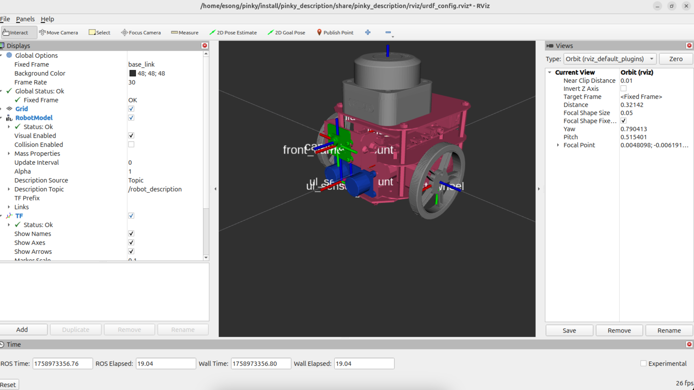
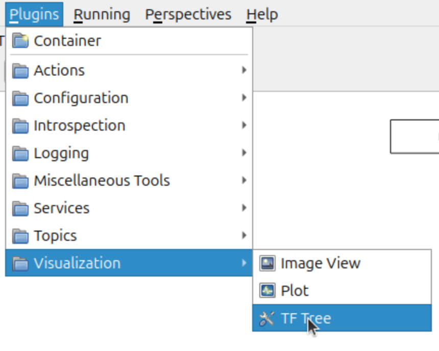

# Pinky 패키지 가져오기

### Pinky 패키지 설치
<br>

**pinky 패키지 clone 해주기**

```bash
mkdir ~/pinky/src
cd ~/pinky/src
git clone https://github.com/PinkWink/pinky_for_edu.git
```

- **패키지 깃허브 링크**: [https://github.com/PinkWink/pinky_for_edu](https://github.com/PinkWink/pinky_for_edu)
<br><br>

**빌드해주기**

```bash
cd ~/pinky
colcon build
source ./install/local_setup.bash
```
<br>

---

### 테스트 해보기
<br>

**ros2 launch 명령어**

```bash
ros2 launch <패키지명> <런치파일명>
```

- ros2 launch 명령어는 여러 노드를 한번에 실행하고, 설정(파라미터, 토픽 remap, 환경 변수 등)을 같이 적용하기 위한 ros2 명령어이다.
- ros2 run은 노드 하나만 실행하지만, ros2 launch는 여러 노드를 동시에 실행 할 수 있다. 예를 들어, Gazebo + RViz + robot_state_publisher 동시 실행
<br><br>

**테스트해보기**

```bash
ros2 launch pinky_description display.launch.xml
```


<br><br>

---

### TF Tree 확인하기
<br>


**1. rqt 명령어 실행**
    
```bash
rqt
```
<br>

**2. plugins → visualization → TF Tree**
    
    
<br>
    
**3. 결과**
    

<br><br><br> 

**만약 Visualization에 TF Tree 항목이 없다면**

```bash
sudo apt install ros-jazzy-tf2-tools
sudo apt install ros-jazzy-rqt-tf-tree
```

```bash
rqt --clear-cofing
```

필요한 두 패키지 설치 후에 rqt 실행해주면 됨. 설치 후 처음 실행할 때는 —clear-config 옵션을 주어 실행해주기(이전에 실행됐던 것들이 남아있으면 함께 뜨는데, 그거 날려주는 옵션)